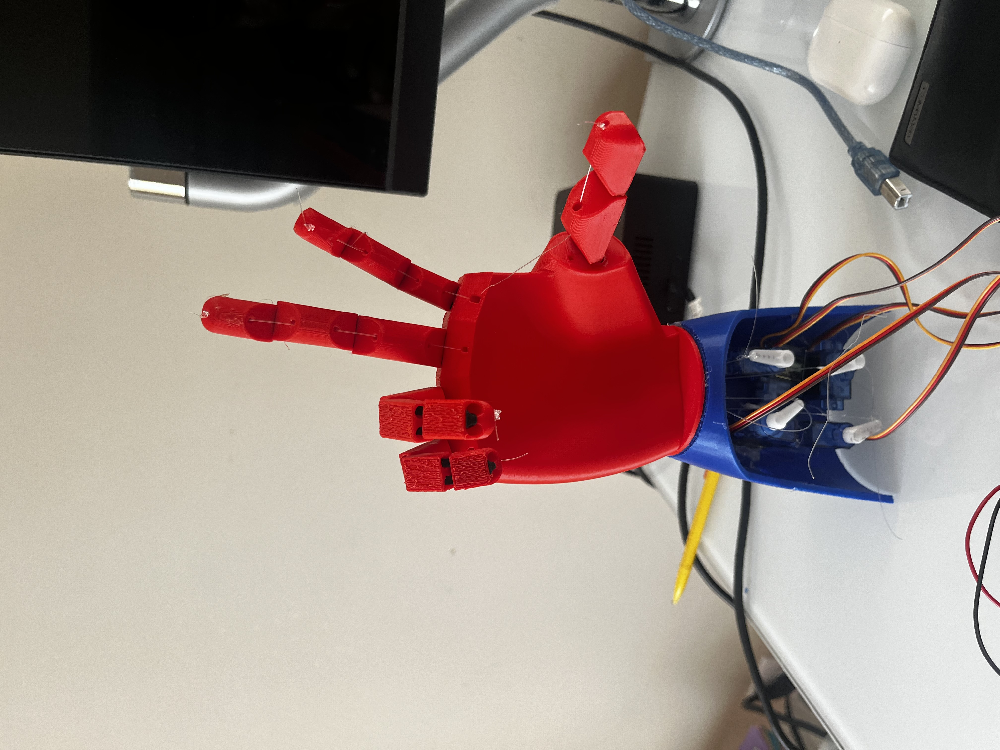

# Bionic Prosthetic Hand

5-DOF 3D-printed prosthetic hand controlled by a wearable flex-sensor glove. Each finger maps 1:1 to a servo via fishing-line tendons, with per-finger calibration to normalize the flex sensor range across different fingers.

50ms end-to-end from glove flex to finger actuation.



## How it works

Each flex sensor is read through a voltage divider into an Arduino ADC pin. The raw reading is mapped to a servo angle using calibrated min/max values per finger. Sensors vary a lot between fingers so calibration is necessary. A deadband on each finger prevents servo jitter from ADC noise.

The hand is fully 3D printed in PLA. Tendons are standard fishing line routed through channels in the finger joints and tied to servo horns. Tension in the tendon closes the finger and a small rubber band at each joint reopens it.

## Hardware

- Arduino Uno
- 5x flex sensors
- 5x hobby servos (MG90S)
- 10k resistors for voltage dividers
- PLA printed hand (STL files in /3d-files)
- Fishing line, 30lb test

## Wiring

```
Flex sensor -> 10k pulldown -> A0-A4
Servos      -> D3, D5, D6, D9, D10
```

Power the servos from an external 5V supply. Do not pull servo current through the Arduino regulator.

## Calibration

On startup the sketch runs a two-step calibration sequence:

1. Hold hand fully open for 3 seconds
2. Close hand fully for 3 seconds

Those values are stored in RAM as per-finger open/closed ADC readings. If calibration feels off just reset and redo it.

## 3D Files

All STLs are in /3d-files. Print in PLA at 0.2mm layer height and 20% infill. The finger assemblies use M2 screws as pivot pins so drill the holes out slightly if they are too tight.

| File | Description |
|---|---|
| Left_Hand.stl / Right_Hand.stl | Palm base |
| Finger_*.stl | Individual finger assemblies |
| Arm.stl / Arm_Cover.stl | Forearm housing for servos |

## TODO

- Add force feedback using FSRs on fingertips
- Replace fishing line with Dyneema for better durability
- Wireless glove version
